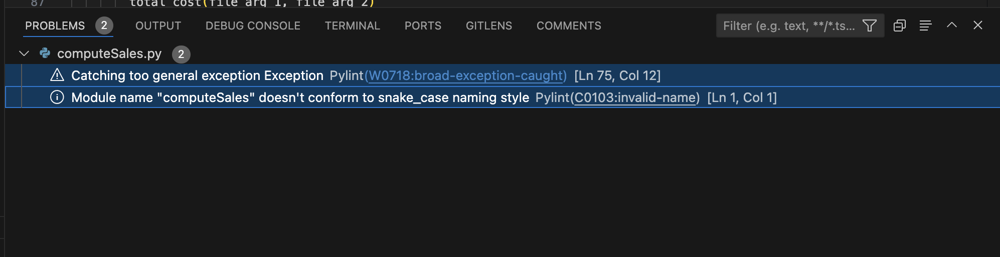

# A01795631_A4.2

Luis Nicanor Gutiérrez
Pruebas de software y aseguramiento de la calidad (Gpo 10)

## Objetivos
2.7 Explicar la diferencia entre pruebas dinámicas y pruebas estáticas

2.8 Describir los beneficios e impacto de la calidad de las prácticas asociadas a pruebas estáticas.

2.9 Explicar el origen de las inspecciones como herramienta de pruebas estáticas.

2.10 Describir las diferencias entre revisiones informales, caminatas estructuradas, inspecciones e inspecciones automáticas.

2.11 Describir la relación de las herramientas de análisis estático y el código fuente.

2.12 Experimentar con el uso de herramientas de análisis estático en el código fuente.

## Ejercicios de programación

### [Compute sales](https://github.com/luisnicg/A01795631_A5.2/tree/main/)

* Programa 1. Análisis de Errores de Pylint – PEP 

* Programa 1. Análisis de Errores de Flake

[Flake result](https://github.com/luisnicg/A01795631_A5.2/blob/main/Evidences/C2-%20Flake.mp4)

* Programa 1. Correcta Ejecución de Casos de Prueba

[Test cases](https://github.com/luisnicg/A01795631_A5.2/blob/main/Evidences/C3-TestCases.mp4)